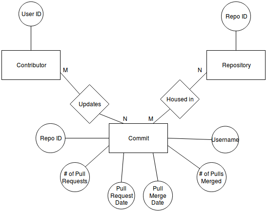
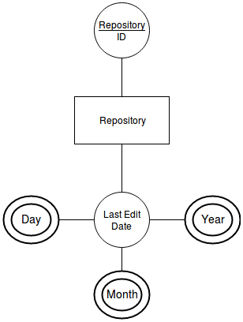
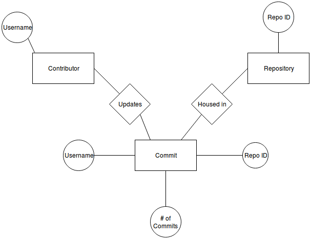

# Group 18 Sprint 1 Design Document

## Deployment Environment

[http://ec2-18-224-184-138.us-east-2.compute.amazonaws.com:3333](http://ec2-18-224-184-138.us-east-2.compute.amazonaws.com:3333)

## Functional Requirements

1. User views data regarding pull requests that are proposed and merged into project
	- Provide visual of a repo shows how many pull requests are there and how many of them are merged
	- Update visual every day to keep an accurate countdown.
2. User can identify inactive repos and either archive them or direct developers to them
	- Provide visual to user of how much time before repo has been inactive for a year
	- Updates visual each day to keep an accurate countdown
3. User wants to view the top contributors by commit to a project
  	- Provide a list with the username ranked by the number of their commits
 	- Show the user with highest commits number as the top contributer of the repo
  	- Update every day tokeep an accurate countdown

## Database Design

### ERD
#### Use Case 1:



#### Use Case 2:



#### Use Case 3:



### DDL

```SQL
# use case 1


CREATE TABLE `Contributor` (

  `id` int(11) NOT NULL AUTO_INCREMENT,

  `user_name` varchar(256) NOT NULL,

  PRIMARY KEY (`id`),

 

);


CREATE TABLE `Repo` (

  `id` int(11) NOT NULL AUTO_INCREMENT,

  PRIMARY KEY (`id`),

);


CREATE TABLE `Commit`(

  `id` int(11) NOT NULL AUTO_INCREMENT,

  `repo_id` int(11) NOT NULL,

  `user_name` varchar(256) NOT NULL,

  `no_of_pull` int(11) NOT NULL,

  `pull_data` datetime,

  `no_of_merge` int(11) NOT NULL,

  `merge_data` datetime,

  PRIMARY KEY (`id`),

  FOREIGN KEY ('repo_id') REFERENCES `Repo`(`repo_id`),

  FOREIGN KEY ('user_name') REFERENCES `Contributor`(`user_name`),

);


#use case 2


CREATE TABLE `Repo` (

  `id` int(11) NOT NULL AUTO_INCREMENT,

  `last_edit_date` datetime

  PRIMARY KEY (`id`),

);


# use case 3


CREATE TABLE `Contributor` (

  `id` int(11) NOT NULL AUTO_INCREMENT,

  `user_name` varchar(256) NOT NULL,

  PRIMARY KEY (`id`),

 

);


CREATE TABLE `Repo` (

  `id` int(11) NOT NULL AUTO_INCREMENT,

  PRIMARY KEY (`id`),

);


CREATE TABLE `Commit`(

  `id` int(11) NOT NULL AUTO_INCREMENT,

  `repo_id` int(11) NOT NULL,

  `user_name` varchar(256) NOT NULL,

  `no_of_commit` int (11) NOT NULL

  PRIMARY KEY (`id`),

  FOREIGN KEY ('repo_id') REFERENCES `Repo`(`repo_id`),

  FOREIGN KEY ('user_name') REFERENCES `Contributor`(`user_name`),

);
```

## Files that are stubbed out in the repository

### User Interface Files

1. ExperimentalCard.vue @ line 42
2. GitCard.vue @ line 72
3. GrowthMaturityDeclineCard.vue @ line 140


### Model Files (Database Access)

  N/A

### Controller Files (API or other)

1. ghtorrent.py @ line 1054
2. ghtorrent.py @ line 1070
3. ghtorrent.py @ line 1085

## Describe languages you need to use, and any gaps in skills on your team.

1. Vue JS
    - Matt has a good amount of experience using Vue JS and will be able to handle the frontend portion of this project.
      If any additional information or examples are necessary, the Vue JS documentation is quite good.
2. Python
    - Chuhang is experienced in Python and will be able to take on that part.
3. SQL
    - Nick is good at SQL and will be assembling the queries we will need to get the data required from the database.
