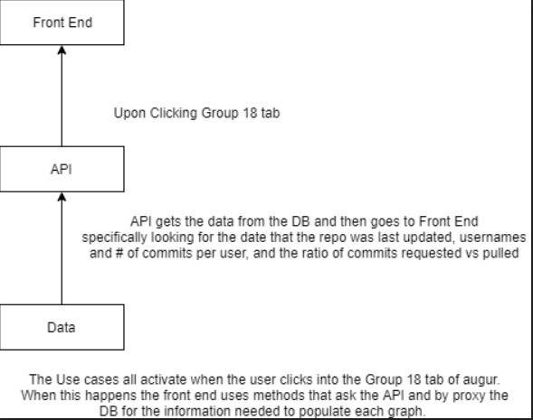
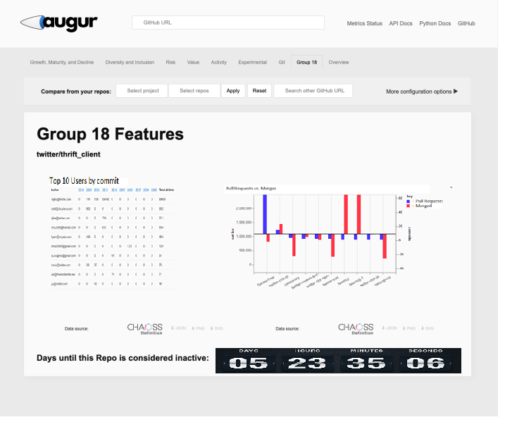
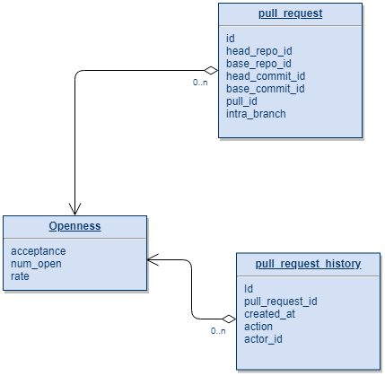
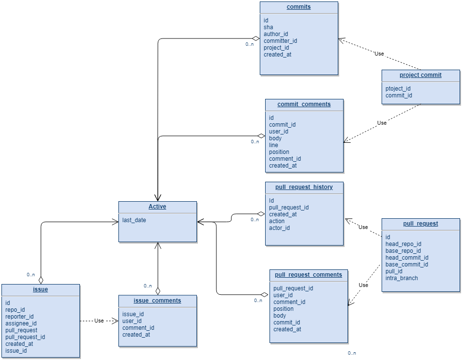
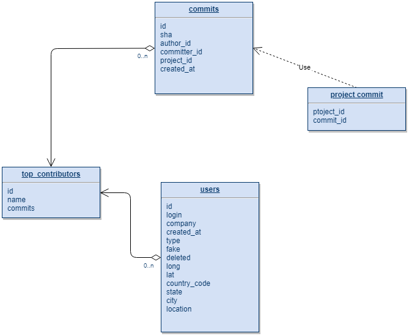

# Group 18 Sprint 2 Design Document

## Deployment Environment

[http://ec2-18-223-33-215.us-east-2.compute.amazonaws.com:3333](http://ec2-18-223-33-215.us-east-2.compute.amazonaws.com:3333)

## Functional Requirements

1. User views data regarding pull requests that are proposed and merged into project
	- Provide visual of a repo shows how many pull requests are there and how many of them are merged
	- After choosing a repo, the system should be able to get number of commit, number of pull requests and the accept rate from database, and show on the site.
	- There should be a chart or figure in frontend showing the number of merged request, total request and the accept rate. 
	- Update visual every day to keep an accurate countdown.
2. User can identify inactive repos and either archive them or direct developers to them
	- Provide visual to user of how much time before repo has been inactive for a year
	- The system should be able to get last edited date of the project from database and judge it as active or unactive.
	- The system should provide buttons for user to archive the project or direct developers.
	- Updates visual each day to keep an accurate countdown
3. User wants to view the top contributors
  	- Show the user with highest commits number as the top contributer of the repo
	- The system should be able to get contributor username and commits from database and communicate with frontend
	- The system should provides a list of ranked contributors and mark the first place.
  	- Update every day to keep an accurate countdown
	
## Necessary for Whole System

1. Data Sources
	- We need the Augur data tables
2. Functions
	- We need SQL functions that send the data from the data tables to the server
	- We need VJS/Python scripts to interpret the data and put it into helpful graphics
3. Web Server
	- We need our EC2 instance to be up and running

## Visual Representation of System



## Visual Representation of Front End



## Database Design

### Database Schema
#### Use Case 1:



#### Use Case 2:



#### Use Case 3:



### DDL

```SQL
# use case 1

SELECT SUM(num_approved) AS acceptance, SUM(num_open) AS num_open, SUM(CAST(num_approved AS DECIMAL))/SUM(CAST(num_open AS DECIMAL)) AS "rate"
            FROM
                (SELECT COUNT(DISTINCT pull_request_id) AS num_approved, DATE(pull_request_history.created_at) AS accepted_on
                FROM pull_request_history
                JOIN pull_requests ON pull_request_history.pull_request_id = pull_requests.id
                WHERE action = 'merged' AND pull_requests.base_repo_id = :repoid
                GROUP BY accepted_on) accepted
            JOIN
                (SELECT count(distinct pull_request_id) AS num_open, DATE(pull_request_history.created_at) AS date_created
                FROM pull_request_history
                JOIN pull_requests ON pull_request_history.pull_request_id = pull_requests.id
                WHERE action = 'opened'
                AND pull_requests.base_repo_id = :repoid
                GROUP BY date_created) opened
            ON opened.date_created = accepted.accepted_on

# use case 2

SELECT DATE(created_at) as "last_date"
            FROM (
               (SELECT DATE(created_at) AS "created_at" FROM commits JOIN project_commits ON project_commits.commit_id = commit_comments.commit_id WHERE project_commits.project_id = :repoid))
               UNION ALL
               (SELECT DATE(created_at) AS "created_at" FROM commit_comments JOIN project_commits ON project_commits.commit_id = commit_comments.commit_id WHERE project_commits.project_id = :repoid)
               UNION ALL
               (SELECT DATE(created_at) AS "created_at" FROM pull_request_history JOIN pull_requests ON pull_requests.id = pull_request_history.id WHERE pull_request_history.action = 'opened' AND pull_requests.`base_repo_id` = :repoid)
               UNION ALL
               (SELECT DATE(created_at) AS "created_at" FROM pull_request_comments JOIN pull_requests ON pull_requests.base_commit_id = pull_request_comments.commit_id WHERE pull_requests.base_repo_id = :repoid)
               UNION ALL
               (SELECT DATE(created_at) AS "created_at" FROM issues WHERE issues.repo_id = :repoid)
               UNION ALL
               (SELECT DATE(created_at) AS "created_at" FROM issue_comments JOIN issues ON issue_comments.issue_id = issues.id WHERE issues.repo_id = :repoid)
            )
            ORDER BY last_date DESC

# use case 3

SELECT users.login as name, a.id AS user, SUM(commits) AS commits

            FROM
            (
               (SELECT committer_id AS id, COUNT(*) AS commits FROM commits INNER JOIN project_commits ON project_commits.commit_id = commits.id WHERE project_commits.project_id = :repoid GROUP BY commits.committer_id)
            ) a JOIN users ON users.id = a.id
            WHERE a.id IS NOT NULL
            GROUP BY a.id
            ORDER BY commits DESC;


```

